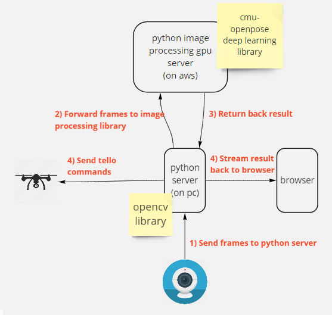
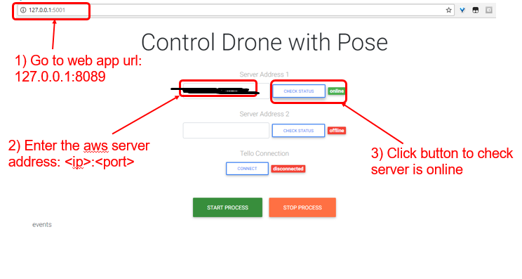
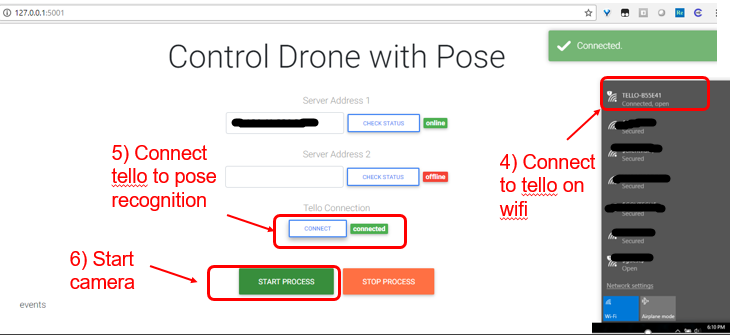

# Controlling Drone with Body Postures
A makerfaire 2018 project. 

## Overview


**Prerequisites**
- Docker
- AWS EC2 GPU (G2/P2/P3)
- Additional wireless network adaptor to connect to tello 
- Camera ( pc webcam will do just fine )
- DJI Tello 

I initially developed this with a cpu as a target server  to process the images, but it 
unsurprisingly turned out to be very slow. Also, midway developement I was thinking about 
using AWS Kinesis Data Streams to stream my video frames to the server, instead of using low level 
sockets. However, it turned out to be quite of a hassle, as I had to think about how to reorder 
the frames as they arrive after being processed in the server. As such, you will see many different configuration 
and environment files lying around in this repo, you don't have to pay attention to them. Just 
follow the steps below and you should be on your way to moving the drones with your hands! :)

## 1) Setup the environment
```powershell
# create your venv folder
python -m venv venv
call venv/Scripts/activate.bat

# install your requirements
pip install -r requirements_gpu.txt

# install the tf-openpose lib
# ref: https://github.com/ildoonet/tf-pose-estimation#install-1
git clone https://github.com/ildoonet/tf-pose-estimation.git
cd tf-openpose
python setup.py install
cd tf_pose/pafprocess
swig -python -c++ pafprocess.i && python3 setup.py build_ext --inplace

```


## 2) Setup the AWS GPU EC2
I used docker-machine to help me setup the aws gpu machine. I recommend using it, it is a very convenient tool for
launching and deploying your docker containers to AWS.

**Open powershell**
```powershell
# Create and launch the aws ec2
docker-machine create 
--driver amazonec2 
--amazonec2-region <your-region> 
--amazonec2-instance-type g2.2xlarge
<machine-name>
```

AWS machine will be created with with these default values if extra settings is not set during creation:
 - amazonec2-root-size <16gbs>
 - amazonec2-ami <a base ubuntu 16.04>

**Setup latest cuda driver and nvidia-docker 2.0**
```powershell
# Restart the instance first, to be sure we are running the latest installed kernel
docker-machine restart <machine-name>

# SSH into the machine
docker-machine ssh <machine-name>

# Install official NVIDIA driver package
sudo apt-key adv --fetch-keys http://developer.download.nvidia.com/compute/cuda/repos/ubuntu1604/x86_64/7fa2af80.pub
sudo sh -c 'echo "deb http://developer.download.nvidia.com/compute/cuda/repos/ubuntu1604/x86_64 /" > /etc/apt/sources.list.d/cuda.list'
sudo apt-get update && sudo apt-get install -y --no-install-recommends linux-headers-generic dkms cuda-drivers

# Add the nvidia-docker 2.0 package repositories
curl -s -L https://nvidia.github.io/nvidia-docker/gpgkey | \
  sudo apt-key add -
distribution=$(. /etc/os-release;echo $ID$VERSION_ID)
curl -s -L https://nvidia.github.io/nvidia-docker/$distribution/nvidia-docker.list | \
  sudo tee /etc/apt/sources.list.d/nvidia-docker.list
sudo apt-get update

# Install nvidia-docker2 and reload the Docker daemon configuration
sudo apt-get install -y nvidia-docker2
sudo pkill -SIGHUP dockerd

# Test nvidia-smi with the latest official CUDA image
docker run --runtime=nvidia --rm nvidia/cuda nvidia-smi

# Exit the machine
exit
```

## 3) Run the image processing server on AWS
Open up powershell and enter the following command

```powershell
cd <path to project directory>
./docker_run.ps1
```

You should see see this prompt
```powershell
Number of workers for thread pool?
```
Enter 2. You should see the following output:

```powershell
('2018-08-01 04:29:12,415 - __main__ - MainThread - INFO - Socket successfuly created and binded to 0.0.0.0:8089
('2018-08-01 04:29:12,416 - __main__ - MainThread - INFO - Listening for connections...
```


## 4)  Run the web application
```powershell
python -m src.webapp.app
```
```powershell
# Output on console
('2018-08-01 12:33:33,305 - werkzeug - Thread-1 - INFO -  * Running on http://127.0.0.1:5001/ (Press CTRL+C to quit)
```

#### Webpage   


#### Demo of the poses recognized 


6 poses: takeoff, land, left, right, flip_forward, flip_backward.

## 5) Setup the tello connection
Turn on the tello and connect to the tello's wifi (You need to attach another wifi adapter to connect 
to a 2nd wifi network. It's cheap, I bought mine for SGD 6 from Lazada.) 
Click on the "Connect to Tello" button on the webpage.




And you are done! :D

## 6) Libraries Use
tf-openpose  
opencv